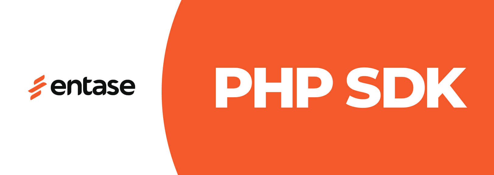

# PHP Development Kit for Entase


This library provides easy access to Entase API for PHP language.



## Requirements and dependencies
PHP 7.4 or later with following extensions enabled:
-   [`curl`](https://secure.php.net/manual/en/book.curl.php)
-   [`json`](https://secure.php.net/manual/en/book.json.php)
-   [`mbstring`](https://secure.php.net/manual/en/book.mbstring.php)

## Setup
The SDK supports only manual installation. Just place the ``src`` folder inside your project and include the ``autoloder.php``.
```php
require_once('/path/to/entase/sdk.php/autoloader.php');
```
*NOTE:* Autoloader will not conflict any other autoloader(s), but if you wish you can use your own. All namespaces and classes are using folder oriented structure.

## Getting started
Initialize the Client with your secret key and you're ready to go.

```php
$entase = new \Entase\SDK\Client('cask_MTY2MDA2MDE3NQabNjJmMjgyMGYyZDAyMTQwNGJhMGYzNWQxZWhnbGxxRkppV3ZP');
$upcoming = $entase->events->GetAll([
  'limit' => 10,
  'filter' => [
      'status' => 1
  ]
]);

foreach($upcoming as $event)
{
  echo date('M d, H:i', $event->dateStart)."\n";
}
```

## The ObjectCollection and ObjectCursor classes
Response from the API comes in two forms - single object or object collection. While both can be accessed directly, the object collection interface has an iterable cursor with some awesome build-in features for paging the requests.

Consider this example:
```php
// Getting all events. Response is limited to 100
$events = $entase->events->GetAll(['limit' => 100]);

// Get events on batches by 100 from the API
while ($events->HasMore())
{
  // Loop the current result set
  foreach($events as $event)
  {
    // Do something ...
  }
}
```
The ``HasMore`` method will automatically lookup and extract additional batch from the API. However use it with caution! Consider performance and try to limit your API requests.

You can also access the events collection manualy by ``$events->data``.

### Custom paging
To handle the pagging function and extract batches from the API by yourself, you can use the ``after`` filter to provide the last object id you have the last result set.

```php
// Getting all events after certain ID. E.g. the next result set.
$events = $entase->events->GetAll(['limit' => 100, 'after' => '6002d051ce1b73294c3aeacc']);
```

## Error fallback
On API errors the Client object will throw exception. Consider catching them so you can provide smooth user flow.
```php
try {
    $productions = $entase->productions->GetAll(['limit' => 10]);
}
catch (\Entase\SDK\Exceptions\Base $ex) { 
    // Fallback code 
}
```

## Supported Endpoints

### GET /productions 
``$entase->productions->GetAll($data=[])``

### GET /productions/{id} 
``$entase->productions->GetByID($id)``

### GET /events 
``$entase->events->GetAll($data=[])``

### GET /events/{id} 
``$entase->events->GetByID($id)``

### GET /partners/{id} 
``$entase->partners->GetByID($id)``

### GET /partners/me 
``$entase->partners->Me()``

### GET /photos/object/{objref} 
``$entase->photos->GetByObject($objref, $data=[])``
